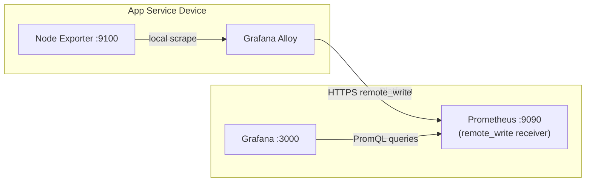

**Previous:** [Prometheus Metrics Setup](./v0-11-prometheus-metrics-setup)

The previous guide set up Prometheus to _pull_ metrics from Node Exporter on a single device. That works fine when you have one Raspberry Pi — but it breaks down as soon as you add a second device or run into firewall restrictions.

This guide upgrades the architecture: each device now runs **Grafana Alloy**, which scrapes Node Exporter locally and _pushes_ metrics to a central Prometheus on the platform. Grafana visualises everything without ever needing inbound access to your devices.



**What this tutorial covers:**

- Why pull-based scraping doesn't scale
- Deploying Grafana Alloy on each device via Ansible
- Configuring Prometheus to accept pushed metrics
- Zero-touch device registration — add a device to inventory and run the playbook

**Time to complete:** 10 minutes (automated deployment)

## Github Repository

All configuration and Ansible roles are available in https://github.com/IaC-Toolbox/iac-toolbox-raspberrypi. Clone it and follow along.

## Why Change the Architecture?

The pull model from the previous guide has two hard problems as you scale:

**1. Manual registration.** Every new device requires editing the Prometheus scrape config on the platform and re-running the playbook _targeting the platform_. With three devices that's manageable. With twenty it's a maintenance burden.

**2. Network access to devices.** Prometheus needs to reach port `9100` on every device. If a device is behind NAT or a firewall, or sits on a different network segment, scraping silently fails and you get no metrics — no errors, just missing data.

The push model solves both. Devices initiate the connection outbound to the platform over HTTPS. Prometheus on the platform only needs to be reachable from devices, not the other way around.

```
OLD (pull model)              NEW (push model)
─────────────────             ────────────────────
Platform → Device :9100       Device → Platform :443
                              (outbound, HTTPS)

Adding a device:              Adding a device:
  1. Edit prometheus.yml        1. Add to [app_services]
  2. Re-run platform playbook   2. Run playbook once
  3. Verify scrape target       Done — metrics appear
```

## New Architecture

```
App Service Device                        Platform (grafana.iac-toolbox.com)
──────────────────                        ──────────────────────────────────

Node Exporter :9100                       Prometheus :9090
      │                                   (remote_write receiver)
      │ local scrape                             │
      ▼                                          │
Grafana Alloy ──── HTTPS remote_write ──────────►
                   (port 443)                    │
                                            Grafana :3000
                                            (datasource: localhost:9090)
```

**Network requirements:**

| Direction | From        | To          | Port | Protocol |
| --------- | ----------- | ----------- | ---- | -------- |
| Outbound  | App service | Platform    | 443  | HTTPS    |
| Inbound   | —           | App service | —    | None     |

No inbound firewall rules needed on your devices.

## Components Overview

| Component       | Role                                           | Runs on     |
| --------------- | ---------------------------------------------- | ----------- |
| `node_exporter` | Expose system metrics at `localhost:9100`      | Each device |
| `grafana-alloy` | Scrape Node Exporter, push via `remote_write`  | Each device |
| `prometheus`    | Accept pushed metrics, store time-series       | Platform    |
| `grafana`       | Visualise metrics, auto-provisioned datasource | Platform    |

## What You Need

Before starting:

- Grafana already running on the platform (previous tutorial)
- SSH access to your devices
- The [iac-toolbox-raspberrypi](https://github.com/IaC-Toolbox/iac-toolbox-raspberrypi) repository
- Devices reachable from the platform (outbound on port 443)

## Deployment Strategy: Docker vs Native Binary

Not everything belongs in Docker. The deployment decisions here are intentional.

**Grafana and Prometheus run in Docker** on the platform. They're isolated services with no reason to touch host internals. Docker makes restarts, upgrades, and config reloads predictable, and on a single platform host the overhead is negligible.

**Node Exporter runs as a native system binary** (not Docker) on every device. This is a hard requirement — Node Exporter needs to read from the host's `/proc` and `/sys` filesystems to report accurate CPU, memory, disk, and network metrics. When run inside a Docker container, it only sees the container's namespaced view of those filesystems, which is incomplete or misleading for real host metrics. Running it natively via a systemd unit (Linux) or launchd plist (macOS) gives it full visibility into actual hardware state.

**Grafana Alloy runs in Docker** on devices, managed by Docker Compose alongside its config. This keeps the deployment consistent across Linux and macOS and avoids the complexity of managing a native binary and systemd unit per architecture.

## Architecture: ARM and Cross-Platform Support

The Ansible roles handle architecture detection automatically. This matters because Raspberry Pis use ARM processors, and binary releases ship separate builds per architecture.

The mapping used across all roles:

| `ansible_architecture` | Binary arch suffix |
| ---------------------- | ------------------ |
| `aarch64`              | `arm64`            |
| `x86_64`               | `amd64`            |
| `armv7l`               | `armv7`            |

This detection runs as a `set_fact` task before any download:

```yaml
- name: Set node_exporter architecture
  set_fact:
    node_exporter_arch: >-
      {{ 'arm64' if ansible_architecture == 'aarch64'
         else 'amd64' if ansible_architecture == 'x86_64'
         else 'armv7' }}
```

The same pattern applies to the Cloudflare Tunnel binary and Grafana Alloy. Running the playbook against a Raspberry Pi 4 (`aarch64`) automatically fetches the `arm64` build; an x86 server gets `amd64`. No inventory changes needed when mixing architectures.

## Platform Docker Network Topology

On the platform, Grafana and Prometheus communicate over a dedicated Docker bridge network named `monitoring`. The deployment order matters:

1. **Grafana is deployed first** — its `docker-compose.yml` declares the `monitoring` network and creates it.
2. **Prometheus is deployed second** — its `docker-compose.yml` declares `monitoring` as `external: true`, meaning it connects to the already-created network rather than creating a new one.

```yaml
# Grafana docker-compose.yml — creates the network
networks:
  monitoring:
    driver: bridge

# Prometheus docker-compose.yml — joins the existing network
networks:
  monitoring:
    external: true
```

This means Prometheus can reach Grafana at `http://grafana:3000` inside Docker, and Grafana can query Prometheus at `http://prometheus:9090` — both using Docker DNS names instead of IP addresses or host ports.

If you deploy Prometheus before Grafana, Docker Compose will fail with `network monitoring not found`. The Ansible playbook deploys Grafana first to enforce this order.

## Inventory Structure

Update your Ansible inventory to separate the platform from app service devices:

```ini
# ansible-configurations/inventory/hosts.ini

[platform]
platform-host ansible_host=<platform-ip>

[app_services]
device-01 ansible_host=<device-01-ip>
device-02 ansible_host=<device-02-ip>
```

Adding a new device later is just adding a line to `[app_services]` and re-running the playbook. No platform changes needed.

## Step 1: Configure Variables

Open the group vars file:

```bash
nano ansible-configurations/inventory/group_vars/all.yml
```

Set the remote_write endpoint and versions:

```yaml
# Alloy config — points to your platform's Prometheus
alloy_remote_write_url: 'https://grafana.iac-toolbox.com/prometheus/api/v1/write'
node_exporter_port: 9100
node_exporter_version: '1.8.1'

# Prometheus on the platform
prometheus_version: '2.52.0'
prometheus_port: 9090

# Grafana on the platform
grafana_port: 3000
grafana_admin_password: '{{ vault_grafana_admin_password }}'
```

The `alloy_remote_write_url` is the only value that must match your actual platform domain.

## Step 2: Deploy the Platform

Run the platform playbook first. This sets up Prometheus with the remote_write receiver enabled, and Grafana with auto-provisioned datasource and dashboard:

```bash
cd ansible-configurations
source .env

./run-playbook.sh playbooks/main.yml --limit platform
```

The playbook:

1. Installs Grafana via Docker Compose (creates the `monitoring` network)
2. Installs Prometheus via Docker Compose (joins the `monitoring` network as external)
3. Enables `--web.enable-remote-write-receiver` on Prometheus
4. Creates a minimal `prometheus.yml` (no static scrape targets for devices)
5. Provisions the Prometheus datasource automatically in Grafana
6. Imports the Node Exporter Full dashboard (ID `1860`)

## Step 3: Deploy to App Service Devices

Now deploy Node Exporter and Grafana Alloy to your devices:

```bash
./run-playbook.sh playbooks/main.yml --limit app_services
```

The playbook:

1. Installs Node Exporter as a native binary, creates a systemd unit, starts the service
2. Deploys Grafana Alloy via Docker Compose
3. Templates `config.alloy` with your remote_write URL
4. Starts Alloy — it immediately begins scraping and pushing

## What Gets Deployed

### On Each Device: Node Exporter

Node Exporter is installed as a native system binary with a systemd unit (Debian/Linux) or launchd plist (macOS). The binary is downloaded directly from the [Prometheus GitHub releases](https://github.com/prometheus/node_exporter/releases) and installed to `/usr/local/bin/node_exporter`.

It exposes system metrics at `localhost:9100/metrics`.

```bash
# Verify it's running
systemctl status node_exporter

# Check it exposes metrics
curl http://localhost:9100/metrics | head -20
```

Config is managed at `~/.iac-toolbox/node-exporter/` on the device.

### On Each Device: Grafana Alloy Config

Grafana Alloy runs in Docker Compose. Ansible templates both `config.alloy` and a `docker-compose.yml` into the Alloy base directory, then runs `docker compose up -d`. The config has two blocks — a scrape job and a remote_write target:

```sh
prometheus.scrape "node_exporter" {
  targets = [{ __address__ = "localhost:9100" }]
  forward_to = [prometheus.remote_write.platform.receiver]
}

prometheus.remote_write "platform" {
  endpoint {
    url = "https://grafana.iac-toolbox.com/prometheus/api/v1/write"
  }
}
```

**What this does:**

- `prometheus.scrape` — hits `localhost:9100/metrics` on a 15-second interval
- `forward_to` — passes scraped metrics directly to the remote_write block
- `prometheus.remote_write` — ships metrics to your platform over HTTPS

Alloy adds an `instance` label automatically so you can filter by device in Grafana.

### On the Platform: Prometheus Config

Prometheus runs in Docker with a minimal scrape config — no `static_configs` for app service devices. They push to it instead. The config file lives at `~/.iac-toolbox/observability/prometheus.yml` on the platform host and is bind-mounted into the container:

```yaml
global:
  scrape_interval: 15s

scrape_configs:
  - job_name: 'prometheus'
    static_configs:
      - targets: ['localhost:9090']
```

The key is the startup flag:

```
--web.enable-remote-write-receiver
```

This activates the `/api/v1/write` endpoint that Alloy pushes to. Without it, Prometheus returns 404 on remote_write requests.

### On the Platform: Grafana Datasource Provisioning

Grafana is provisioned automatically with a YAML file — no manual datasource setup. The file lives at `~/.iac-toolbox/grafana/provisioning/datasources/prometheus.yml` on the platform host and is bind-mounted into the Grafana container:

```yaml
apiVersion: 1
datasources:
  - name: Prometheus
    type: prometheus
    url: http://localhost:9090
    isDefault: true
```

This file is written by Ansible to Grafana's provisioning directory. On startup, Grafana loads it and the datasource is available immediately.

## Step 4: Verify Metrics Are Arriving

### Check Alloy on a Device

```bash
# Service status
systemctl status grafana-alloy

# Live logs — look for successful remote_write
journalctl -u grafana-alloy -n 50 -f
```

A healthy Alloy log looks like:

```
level=info msg="Scrape completed" target=localhost:9100 duration=2.4ms
level=info msg="remote_write batch sent" url=https://grafana.iac-toolbox.com/...
```

### Check Prometheus on the Platform

Query the Prometheus API to confirm metrics are arriving from your devices:

```bash
# Should return targets from app service devices
curl "http://localhost:9090/api/v1/query?query=up"
```

You should see entries with `job="node_exporter"` and `instance` labels matching your device hostnames.

```bash
# Check a specific metric
curl "http://localhost:9090/api/v1/query?query=node_memory_MemAvailable_bytes"
```

### Check in Grafana

Open Grafana in your browser:

```
https://grafana.iac-toolbox.com
```

1. Click **Dashboards** → **Node Exporter Full**
2. At the top of the dashboard, use the **Instance** drop-down to select your device
3. You should see CPU, memory, disk, and network metrics updating every 15 seconds

Each device appears as a separate instance in the drop-down. No dashboard changes needed when you add more devices — they appear automatically.

## Adding a New Device

This is where the push model pays off. To add `device-03`:

1. Add it to inventory:

   ```ini
   [app_services]
   device-01 ansible_host=<device-01-ip>
   device-02 ansible_host=<device-02-ip>
   device-03 ansible_host=<device-03-ip>   # new
   ```

2. Run the playbook targeting only the new device:

   ```bash
   ./run-playbook.sh playbooks/main.yml --limit device-03
   ```

3. Within 60 seconds, `device-03` metrics appear in Grafana.

No platform changes. No Prometheus config edits. No restarts.

## The `instance` / `nodename` Label Mismatch

The Node Exporter Full dashboard (ID 1860) uses two different labels to identify devices, and they must match for filtering to work.

The `$node` variable at the top of the dashboard is populated from the `nodename` label inside the `node_uname_info` metric — this is the actual system hostname as reported by `uname`, e.g. `raspberry-4b`. Dashboard panels then filter all metrics with `instance="$node"`, so a panel querying CPU usage looks for `instance="raspberry-4b"`.

When Alloy scrapes Node Exporter and pushes to Prometheus, it attaches an `instance` label to every metric. If that `instance` label is set to anything other than the system hostname — for example a friendly name like `raspberry-pi` — the filter breaks:

```
$node dropdown selects:  raspberry-4b   (from nodename in node_uname_info)
Dashboard query filters: instance="raspberry-4b"
Actual instance label:   raspberry-pi
Result:                  No data / N/A
```

You can verify this at any time:

```bash
curl -s "http://localhost:9090/api/v1/query?query=node_uname_info" \
  | python3 -m json.tool | grep -E "instance|nodename"
```

If `instance` and `nodename` differ, the dashboard panels that use `instance="$node"` will show N/A even though the data is in Prometheus.

A related issue: Alloy sets the `job` label to its full internal component path (`prometheus.scrape.node_exporter`) rather than a clean `node_exporter`. The dashboard's `$job` variable filters for `node_exporter` exactly — so every panel that uses `job="$job"` returns no data even when `instance` is correct. The fix is to explicitly set both labels in the scrape target:

```river
targets = [{
  __address__ = "host.docker.internal:9100",
  instance    = "raspberry-4b",
  job         = "node_exporter",   // must be set explicitly — Alloy defaults to its component path
}]
```

**`$__rate_interval` resolving incorrectly for remote_write metrics**

The Node Exporter Full dashboard uses `$__rate_interval` in rate queries like:

```promql
100 * (1 - avg(rate(node_cpu_seconds_total{mode="idle",instance="$node",job="$job"}[$__rate_interval])))
```

Grafana calculates `$__rate_interval` as 4× the scrape interval it knows about. For metrics scraped directly by Prometheus, it reads the scrape config. For metrics arriving via remote_write (pushed by Alloy), Prometheus has no scrape config entry — so Grafana may compute a zero or incorrect interval, causing `rate()` to return no data even when the metrics are present.

The fix is to set `scrape_interval` explicitly in the Alloy scrape config:

```river
prometheus.scrape "node_exporter" {
  targets = [{
    __address__ = "host.docker.internal:9100",
    instance    = "raspberry-4b",
    job         = "node_exporter",
  }]
  scrape_interval = "15s"   // required — Grafana uses this to compute $__rate_interval
  forward_to = [prometheus.remote_write.platform.receiver]
}
```

Without this, panels like CPU Busy, Memory Used, and Disk I/O will show N/A even though the underlying data is in Prometheus. You can confirm by running the query manually in Grafana Explore with a fixed interval (e.g. `[2m]`) — if that returns data but the dashboard panel is N/A, `scrape_interval` is the missing piece.

The fix is to keep `instance` equal to the system hostname.

**How to get the correct nodename automatically**

Before setting any label, check what `nodename` Node Exporter reports on that device:

```bash
curl -s http://localhost:9100/metrics | grep node_uname_info
```

The `nodename` field in the output is the value the dashboard will use for `$node`. Your `instance` label must equal this exactly:

```
node_uname_info{...,nodename="raspberry-4b",...} 1
→ instance must be "raspberry-4b"

node_uname_info{...,nodename="vvasylkovskyi-F719T9V3V4",...} 1
→ instance must be "vvasylkovskyi-F719T9V3V4"
```

**The safest approach: don't set `instance_name` at all**

The Ansible role templates `instance` as `{{ grafana_alloy.instance_name | default(ansible_hostname) }}`. If you don't set `instance_name` in your device config file, Ansible reads the hostname directly from the target system — the same value that Node Exporter exposes as `nodename`. They're guaranteed to match because they come from the same source.

```yaml
# device config — just omit instance_name entirely
grafana_alloy:
  enabled: true
  alloy_remote_write_url: https://prometheus.iac-toolbox.com/api/v1/write
  # no instance_name here
```

Setting a friendly name like `"mac"` or `"raspberry-pi"` looks cleaner in the dropdown but breaks the dashboard's filtering unless you also override `nodename` everywhere — which is more complexity than it's worth. Stick with the real hostname.

If you ever need to verify the labels are consistent across all devices:

```bash
# On the platform — compare instance vs nodename for every device
curl -s "http://localhost:9090/api/v1/query?query=node_uname_info" \
  | python3 -m json.tool | grep -E '"instance"|"nodename"'
```

All `instance` and `nodename` values should be identical pairs. Any mismatch means that device's dashboard panels will show N/A.

## Troubleshooting

### Alloy Won't Start

Check configuration syntax:

```bash
grafana-alloy fmt /etc/alloy/config.alloy
```

Check logs for errors:

```bash
journalctl -u grafana-alloy -n 100
```

Common causes:

- `alloy_remote_write_url` is unreachable from the device (test with `curl <url>`)
- Config template has a syntax error (re-run the Ansible role)
- Node Exporter isn't running yet (check `systemctl status node_exporter`)

### Remote Write Returns 404

Prometheus is running but rejecting remote_write requests. Verify the feature flag is set by inspecting the Docker Compose config on the platform:

```bash
# On the platform
cat ~/.iac-toolbox/observability/docker-compose.yml | grep enable-feature
# Should show: --web.enable-remote-write-receiver
```

If the flag is missing, re-run the platform playbook — the role templates the Docker Compose file with the correct flags.

### Metrics Arrive but Show Wrong Instance Label

Alloy auto-sets `instance` from the device hostname. If you want a custom label, add an `extra_labels` block to the Alloy config template in the Ansible role:

```sh
prometheus.scrape "node_exporter" {
  targets = [{ __address__ = "localhost:9100" }]
  extra_labels = { "site" = "home-lab", "rack" = "A1" }
  forward_to = [prometheus.remote_write.platform.receiver]
}
```

Re-run the `grafana-alloy` role to apply it.

### No Data After 5 Minutes

Run through this checklist:

```bash
# 1. Node Exporter responding?
curl http://localhost:9100/metrics | head -5

# 2. Alloy running and pushing?
systemctl status grafana-alloy
journalctl -u grafana-alloy -n 20

# 3. Platform Prometheus reachable from device?
curl https://grafana.iac-toolbox.com/prometheus/-/healthy

# 4. Metrics in Prometheus?
curl "http://localhost:9090/api/v1/query?query=up{job='node_exporter'}"
```

Work through each step in order. The first failure is where to focus.

### Grafana Dashboard Shows "No Data"

Check the time range (top right) — set it to **Last 15 minutes**.

Verify the datasource is pointing to `http://localhost:9090`:

1. **Connections** → **Data sources** → **Prometheus**
2. Click **Save & test** — should show "Data source is working"

If the datasource was provisioned correctly by Ansible, this is typically a time range issue.

### macOS Memory Panels Show N/A — Fixed with Alloy Relabeling

The Node Exporter Full dashboard (ID 1860) is built for Linux and expects memory metric names sourced from `/proc/meminfo`. macOS doesn't have `/proc`, so Node Exporter exposes memory under different names:

| Linux (dashboard expects)        | macOS (Node Exporter exposes)      |
| -------------------------------- | ---------------------------------- |
| `node_memory_MemTotal_bytes`     | `node_memory_total_bytes`          |
| `node_memory_MemAvailable_bytes` | `node_memory_free_bytes` (approx)  |
| `node_memory_SwapTotal_bytes`    | no equivalent (page counters only) |
| `node_memory_SwapFree_bytes`     | no equivalent                      |

You can verify what your Mac exposes:

```bash
curl -s http://localhost:9100/metrics | grep "^node_memory"
```

Rather than editing the dashboard, the Ansible role handles this automatically using Alloy's `prometheus.relabel` component. The Alloy config template includes OS-conditional relabeling rules that rename macOS metrics to the Linux names before pushing to Prometheus:

```river
prometheus.relabel "node_exporter_compat" {
  forward_to = [prometheus.remote_write.platform.receiver]

  // Only applied on macOS (Darwin) — on Linux this block is empty
  rule {
    source_labels = ["__name__"]
    regex         = "node_memory_total_bytes"
    target_label  = "__name__"
    replacement   = "node_memory_MemTotal_bytes"
  }
  rule {
    source_labels = ["__name__"]
    regex         = "node_memory_free_bytes"
    target_label  = "__name__"
    replacement   = "node_memory_MemAvailable_bytes"
  }
}
```

The scrape component forwards metrics through this relabel stage before remote_write. On Linux, the relabel component has no rules and passes metrics unchanged. On macOS, the two rules fire and the dashboard's RAM Used and RAM Total panels populate correctly.

**Swap panels are also fixed — with a two-part approach.** macOS exposes swap as `node_memory_swap_total_bytes` and `node_memory_swap_used_bytes`, but the dashboard needs `node_memory_SwapTotal_bytes` and `node_memory_SwapFree_bytes`. The rename for total is straightforward, but free requires arithmetic (`total - used`), which Alloy relabeling can't do. The solution splits the work across two components:

**Alloy (device side):** one more rename rule renames the total:

```river
rule {
  source_labels = ["__name__"]
  regex         = "node_memory_swap_total_bytes"
  target_label  = "__name__"
  replacement   = "node_memory_SwapTotal_bytes"
}
```

`node_memory_swap_used_bytes` passes through unchanged.

**Prometheus (platform side):** a recording rule computes the missing free bytes:

```yaml
groups:
  - name: macos_compat
    interval: 15s
    rules:
      - record: node_memory_SwapFree_bytes
        expr: node_memory_SwapTotal_bytes - node_memory_swap_used_bytes
```

This rule runs on the platform every 15 seconds. Prometheus derives `SwapFree` from the two macOS metrics, and the dashboard query (`SwapTotal - SwapFree`) resolves to `swap_used_bytes` — the correct value. The recording rule is safe to deploy unconditionally: if no macOS devices are pushing data, the expression produces no output and there is no side effect on Linux metrics.

## Summary

You've upgraded from a single-device pull model to a scalable push-based pipeline.

**What you accomplished:**

- Grafana Alloy installed on each device, scraping Node Exporter and pushing to the platform
- Prometheus running with `remote-write-receiver` enabled — no static scrape configs for devices
- Grafana auto-provisioned with Prometheus datasource and Node Exporter dashboard
- Zero-touch device registration — inventory change + playbook run is all it takes

**Key files deployed:**

On each device:

- `~/.iac-toolbox/alloy/config.alloy` — Alloy scrape and remote_write config
- `~/.iac-toolbox/alloy/docker-compose.yml` — Docker Compose definition

On the platform:

- `~/.iac-toolbox/observability/prometheus.yml` — minimal config, remote_write receiver enabled
- `~/.iac-toolbox/grafana/provisioning/datasources/prometheus.yml` — auto-provisioned datasource

**Access:**

- **Grafana Dashboard**: https://grafana.iac-toolbox.com/d/rYdddlPWk/node-exporter-full
- **Prometheus API** (on platform): `http://localhost:9090/api/v1/query?query=up`
- **Alloy logs** (on device): `journalctl -u grafana-alloy -f`

**What makes this different from the pull model:**

- No inbound firewall rules needed on devices
- Adding devices requires only an inventory change — no platform edits
- Each device manages its own metrics pipeline independently
- Works across network topologies: NAT, VPN, cloud VMs, Raspberry Pis on home networks

---

**Previous:** [Prometheus Metrics Setup](./v0-11-prometheus-metrics-setup) | **Next:** [Logs with Loki](./v0-12-logs-with-loki)
