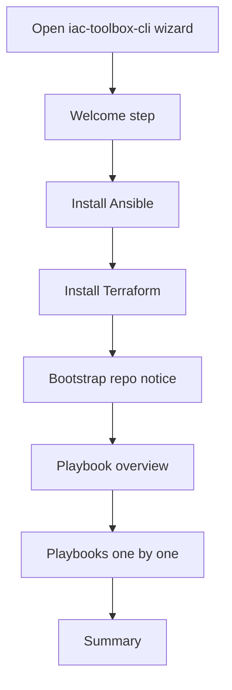

# Interactive Setup Wizard Plan

## Goal

Design an interactive setup wizard in `iac-toolbox-cli` that guides a user through Raspberry Pi infrastructure setup step by step.

For this phase, keep the scope **UI only** with a **mocked backend**.

The wizard should represent the same broad flow as the Raspberry Pi install process, but as a guided installer with:

- clear explanations
- built-in approval
- skip support at every step
- visible progress
- a structure that can later be connected to real execution

## Requested Behavior

The first wizard version should guide the user through:

1. **Install Ansible**
2. **Install Terraform**
3. **Acknowledge bootstrap notice** explaining that setup files come from `IaC-Toolbox/iac-toolbox-raspberrypi`
4. **Install playbooks one by one**

Every step should allow:

- **Continue / Approve**
- **Skip**
- **Back** where sensible

## High-Level Flow



Key takeaways:

- the flow is linear by default
- each step can be approved or skipped
- playbooks are presented as separate install units, not one opaque block

## Current State / Problem

The current CLI repo is still a minimal Ink app.

That is useful for styling and terminal rendering, but it does not yet provide:

- a guided setup flow
- step state management
- built-in approvals
- skip-aware progress
- a UX model for later backend execution

If we jump directly into wiring real commands, we risk hardcoding a poor installer experience.

## Proposed Approach

Build the first version as a **guided wizard UI** backed by a **mock step engine**.

This means:

- no real shell execution yet
- no real package installation yet
- no real file downloads yet
- no real `.env` writing yet

Instead, the first PR should define the interaction model clearly and make the wizard feel real enough to review.

## UX Principles

### Guided, not overwhelming

Reveal one step at a time.

For each step, show:

- what this step does
- why it matters
- what would happen if approved
- whether it is optional

### Approval is part of the UX

Every actionable step should have an explicit approval moment.

Example pattern:

- step title
- short explanation
- mocked action preview
- actions: `Continue`, `Skip`, maybe `Back`

### Skip is a first-class path

Every step should be skippable.

Skipped steps should remain visible in progress and in the summary so the user understands what was intentionally not done.

### Progress should always be visible

The wizard should always show:

- current step index
- total number of steps
- current step title
- counts for completed / skipped / remaining

Example:

```text
Step 2 of 6 — Install Terraform
Completed: 1 | Skipped: 0 | Remaining: 4
```

## Phase 1 Step Model

Recommended top-level steps:

1. **Welcome**

   - explain the wizard
   - explain skip support
   - explain that this phase is mocked

2. **Install Ansible**

   - explain why Ansible is needed
   - show mocked action preview
   - allow approve or skip

3. **Install Terraform**

   - explain why Terraform is needed
   - show mocked action preview
   - allow approve or skip

4. **Bootstrap Repository Notice**

   - explain that setup depends on:
     - `https://github.com/IaC-Toolbox/iac-toolbox-raspberrypi`
   - clarify that a later phase may clone/download/update files locally
   - allow continue or skip

5. **Playbook Selection Overview**

   - explain that installation is presented unit by unit
   - show which playbooks/roles will follow

6. **Install Playbooks One by One**
   Suggested mocked sub-steps:

   - base/setup
   - docker
   - vault
   - cloudflare tunnel
   - grafana
   - prometheus
   - loki
   - openclaw
   - github runner

7. **Summary**
   - show completed steps
   - show skipped steps
   - show failed steps
   - show what a real backend would do next

## Why separate playbook steps matter

Treating playbooks as separate install units makes the wizard easier to review and easier to trust.

Benefits:

- the user sees progress more clearly
- each step can explain its own purpose
- approvals are more concrete
- skip behavior is straightforward
- later backend mapping to tags/scripts remains possible

## Proposed UI Layout

A simple full-screen Ink layout is enough for v1.

### Layout

1. **Header**

   - product name
   - current mode, e.g. `Mocked setup wizard`

2. **Progress area**

   - step list or progress strip
   - current step highlighted
   - completed/skipped/failed markers

3. **Main content area**

   - step title
   - explanation
   - mocked action preview
   - warnings or notes if relevant

4. **Footer**
   - available actions / keys
   - example: `Enter = Continue`, `S = Skip`, `B = Back`, `Q = Quit`

## Interaction Model

### Recommended keyboard controls

Suggested defaults:

- `Enter` → Continue / Approve
- `s` → Skip current step
- `b` → Back
- `q` → Quit wizard

Optional later:

- arrow keys or `j/k` for navigating lists

### Approval wording

Use concrete wording.

Examples:

- `Approve mocked Ansible installation step?`
- `Skip Terraform installation for now?`
- `Proceed to playbook installation overview?`

## Mocked Backend Shape

The UI should be built against a mocked step runner, not directly against command execution.

### Suggested types

```ts
export type WizardStepStatus =
  | 'idle'
  | 'ready'
  | 'running'
  | 'success'
  | 'failed'
  | 'skipped';

export type WizardStep = {
  id: string;
  title: string;
  description: string;
  optional?: boolean;
  kind: 'info' | 'approval' | 'install';
  preview?: string[];
  status: WizardStepStatus;
  children?: WizardStep[];
};
```

### Suggested mocked runner API

```ts
interface WizardRunner {
  getSteps(): WizardStep[];
  runStep(stepId: string): Promise<void>;
  skipStep(stepId: string): void;
  goBack(): void;
}
```

### Mock behavior for v1

`runStep()` can simply:

- set state to `running`
- wait 600–1200ms
- resolve with `success`

That is enough to make the UI realistic without side effects.

## Example playbook step model

```ts
{
  id: 'playbook-vault',
  title: 'Install Vault',
  description: 'Deploy HashiCorp Vault for secrets management.',
  optional: true,
  kind: 'install',
  preview: [
    'Would run the Vault installation flow',
    'Would prepare data/config directories',
    'Would enable required services'
  ],
  status: 'idle'
}
```

## Suggested Component Structure

```text
src/
  app.tsx
  cli.tsx
  wizard/
    WizardApp.tsx
    WizardLayout.tsx
    WizardHeader.tsx
    WizardProgress.tsx
    WizardStepView.tsx
    WizardFooter.tsx
    mockSteps.ts
    useWizardState.ts
    types.ts
```

## Visual Style

Keep the current polished Ink style, but shift it from a hello-world dashboard to a guided installer.

Preferred feel:

- clean headings
- muted explanatory copy
- strong status markers
- minimal visual noise
- GitHub-review-friendly screenshots/output if shared later

Suggested status colors:

- ready → cyan
- running → violet
- success → green
- skipped → yellow
- failed → red
- explanatory/muted → gray

## Summary Screen

At the end of the flow, show:

- completed steps
- skipped steps
- failed steps
- what remains for a real backend later

Example:

```text
Setup summary

Completed
- Install Ansible
- Install Terraform
- Bootstrap notice acknowledged
- Install Docker
- Install Vault

Skipped
- Install Grafana
- Install GitHub Runner

Pending in real backend
- Write environment file
- Execute playbook commands
- Persist setup state
```

## Validation Approach

For this phase, validation is UI-focused.

Definition of a good first implementation:

- the wizard renders clearly in Ink
- the step flow is easy to follow
- continue / skip / back behavior feels coherent
- progress updates correctly
- mocked running state feels believable
- end summary reflects completed/skipped state accurately

## Non-goals for this phase

Do **not** include these yet:

- real shell command execution
- real Ansible/Terraform installation
- real repo cloning/downloading
- writing `.env` values
- API key collection
- persistent resume state
- real backend approvals/execution engine

## Definition of Done

Phase 1 is done when:

- the wizard UI exists in `iac-toolbox-cli`
- the planned steps are navigable
- every step supports continue and skip
- progress is visible throughout
- a mocked backend drives realistic status changes
- the summary screen accurately reflects outcomes

## Open Questions

1. Should all playbook steps be shown by default, or should some live behind an advanced view?
2. Should the progress UI be a sidebar list or a top strip for narrow terminals?
3. Should skipped steps be revisitable from the summary screen?
4. Should the wizard eventually be the default CLI experience, or start as a subcommand?
5. Should the first UI also include a basic-vs-advanced mode choice, or keep that out of phase 1?

## Recommended Next Step

Review and approve this plan.

Then implement the mocked wizard UI in `iac-toolbox-cli` using the proposed step model and mocked runner.
